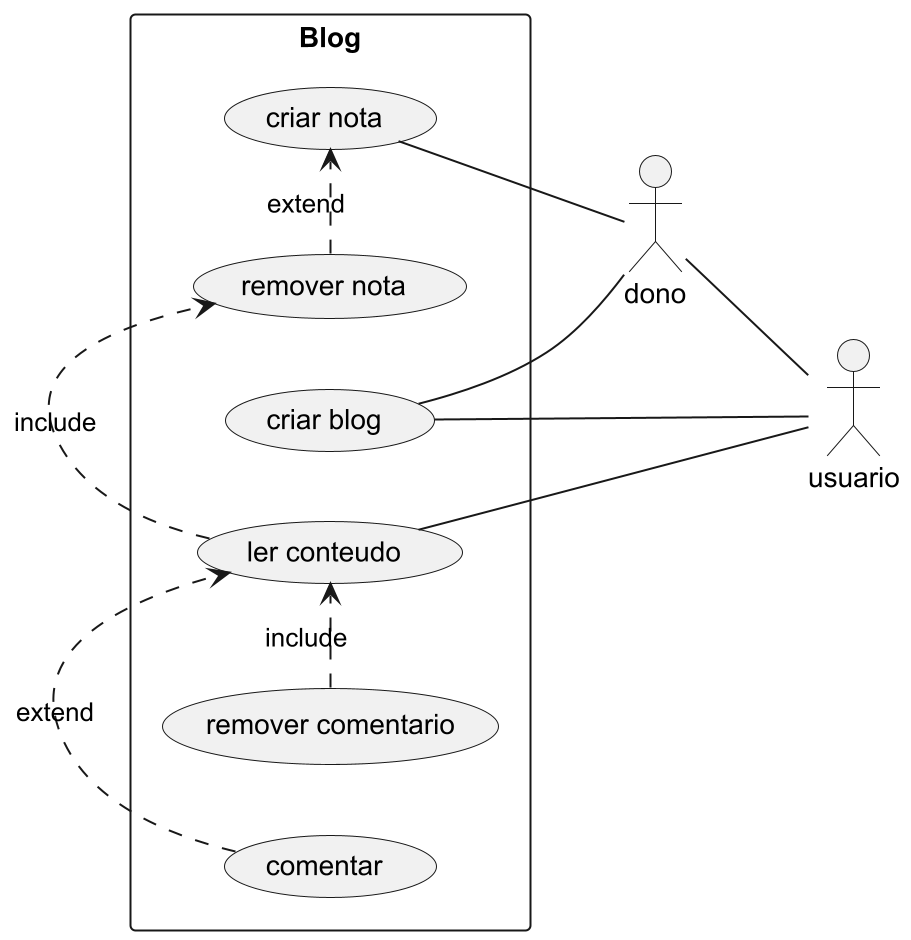
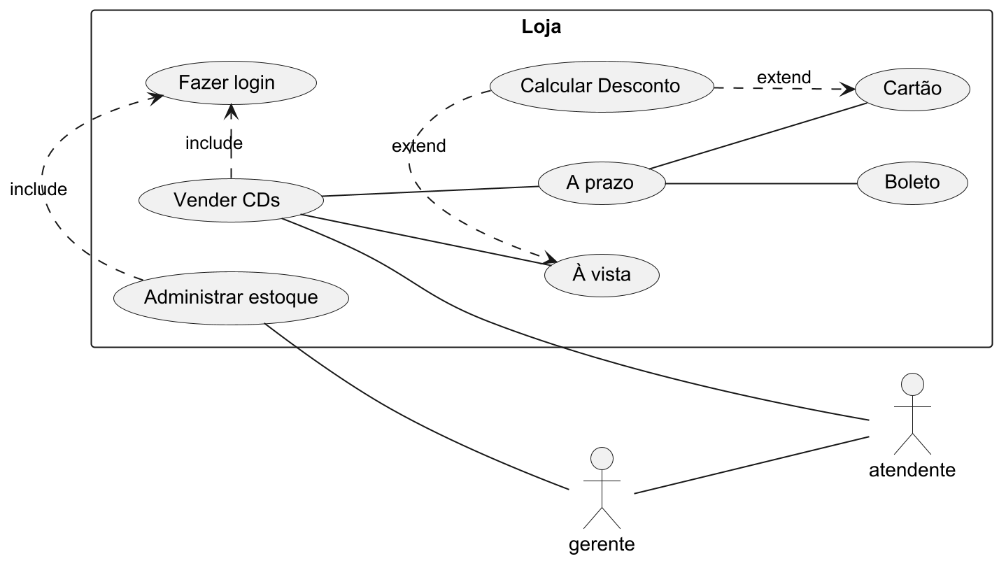
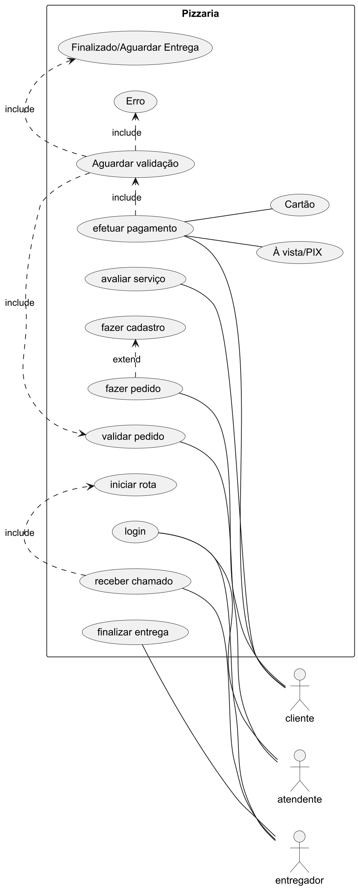

# Meu Projeto com PlantUML

Este projeto utiliza o PlantUML para gerar diagramas a partir de arquivos `.wsd`.

## Instalação

### Requisitos

- Java JDK 8 ou superior
- Graphviz (opcional, mas recomendado)

### 2. Baixar o PlantUML

Baixe o arquivo `plantuml.jar` do [site oficial](https://plantuml.com/download) e coloque em uma pasta, por exemplo, `~/plantuml`.

### 3. (Opcional) Instalar o Graphviz

Para instalar o Graphviz:

#### Ubuntu

```bash
sudo apt install graphviz
```

#### Windows

Baixe o instalador do [site do Graphviz](https://graphviz.gitlab.io/_pages/Download/Download.html) e siga as instruções.

### 4. Executar o PlantUML

Para gerar um diagrama a partir de um arquivo `.wsd`, use o seguinte comando no terminal:

```bash
java -jar ~/plantuml/plantuml.jar seu_diagrama.wsd
```

## Uso no Visual Studio Code

1. Instale a extensão "PlantUML" no VSCode.
2. Crie um arquivo `.wsd` e escreva seu diagrama.
3. Use `Alt+D` para visualizar o diagrama.

## Casos de Uso e Diagramas

### 1. Blog

#### Caso de Uso: Interação com Blog
**Ator Principal**: Usuário  
**Atores Secundários**: Dono do Blog  
**Objetivo**: Interagir com o conteúdo do blog.

#### Passos:
1. Acessar o Blog: O usuário entra no blog.
2. Ler Conteúdos: O usuário visualiza as notas publicadas.
3. Comentar em uma Nota: O usuário escolhe uma nota e adiciona um comentário.
4. Remover Comentário: O usuário pode remover seus próprios comentários.
5. Criar um Blog (para Usuário): O usuário pode criar um novo blog.
6. Criar Nota (para Dono do Blog): O dono do blog pode criar novas notas.
7. Remover Nota (para Dono do Blog): O dono do blog pode remover notas existentes.

### Requisitos:
- Para remover um comentário, o usuário deve ter lido o conteúdo associado.

#### Diagrama UML:


### 2. Loja de CDs

#### Caso de Uso: Venda de CDs
**Ator Principal**: Cliente  
**Atores Secundários**: Gerente, Atendente 
**Objetivo**: Comprar CDs na loja.

#### Passos:
1. Entrar na Loja: O cliente chega à loja de CDs.
2. Escolher CDs: O cliente seleciona os discos que deseja comprar.
3. Pedir Ajuda: Se necessário, o cliente solicita ajuda ao atendente ou ao gerente.
4. Realizar a Compra: O atendente ou gerente registra os CDs escolhidos. O cliente efetua o pagamento.
5. Receber os CDs: O cliente recebe os discos comprados.

#### Diagrama UML:


### 3. Pizzaria

#### Caso de Uso: Pedido de Pizza
**Ator Principal**: Cliente  
**Atores Secundários**: Atendente, Entregador
**Objetivo**: Pedir uma pizza para entrega.

#### Passos:
1. Fazer cadastro.
2. Fazer pedido.
3. Efetuar pagamento pelo cartão ou à vista/pix.
4. Sistema valida o pedido (finalizado ou com erro).
5. Cliente pode avaliar o pedido.

#### Diagrama UML:


## Salvar Diagramas

Salve os arquivos `.wsd` e execute o comando:

```bash
java -jar ~/plantuml/plantuml.jar exemplo.wsd
```

Isso gerará um arquivo PNG com o diagrama.